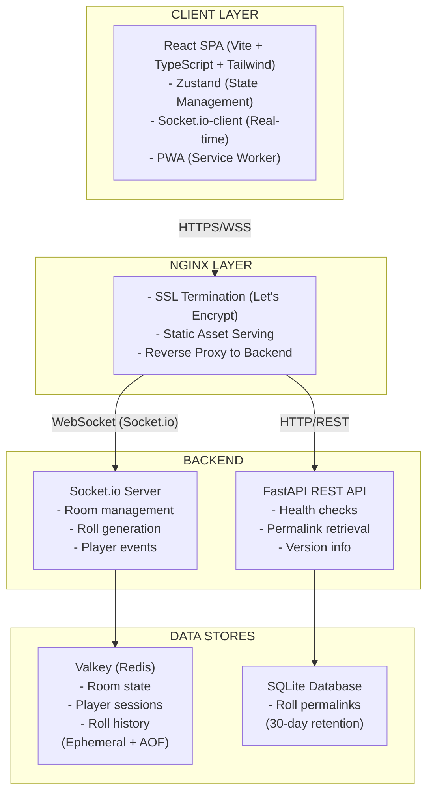

# D&D Dice Roller - Architecture Document

**Author:** Steve
**Date:** 2025-11-15
**Version:** 1.0
**Status:** Approved for Implementation

---

## Executive Summary

This architecture document defines the technical design for the D&D Dice Roller, a real-time multiplayer web application. The system enables gaming groups to share dice rolls synchronously with complete trust and transparency through ephemeral game rooms, DM features, and permanent roll permalinks.

**Architecture Philosophy:** Leverage modern starter templates and proven patterns to minimize custom infrastructure while maintaining flexibility for the unique real-time multiplayer requirements.

---

## Table of Contents

1. [System Overview](#system-overview)
2. [Architectural Decisions](#architectural-decisions)
3. [Technology Stack](#technology-stack)
4. [System Architecture](#system-architecture)
5. [Data Architecture](#data-architecture)
6. [API Design](#api-design)
7. [Security Architecture](#security-architecture)
8. [Deployment Architecture](#deployment-architecture)
9. [Observability & Monitoring](#observability--monitoring)
10. [Testing Strategy](#testing-strategy)
11. [Implementation Roadmap](#implementation-roadmap)

---

## System Overview

### Core Capabilities

1. **Real-Time Dice Rolling** - Cryptographically secure server-side roll generation with sub-500ms synchronization
2. **Ephemeral Rooms** - WORD-#### coded rooms with dual modes (Open/DM-led), auto-expiring based on activity
3. **Roll Permalinks** - 30-day persistent shareable URLs for every roll (killer feature)
4. **DM Features** - Hidden rolls, DC threshold checking, room promotion
5. **Connection Resilience** - Automatic reconnection, grace periods, fallback modes

### Scale & Performance Targets

- **Concurrent Users:** 400+ players (50 rooms × 8 players)
- **Latency:** < 500ms roll synchronization (p95)
- **Uptime:** 99% during game sessions (Friday nights 7-10pm PST)
- **Load Time:** < 2s on 3G connection
- **History Capacity:** 500+ rolls per room with smooth scrolling

---

## Architectural Decisions

All architectural decisions are documented as individual ADRs:

- **[ADR-001: Project Initialization via Full-Stack Template](./architecture/adrs/001-project-initialization-template.md)**
  Use `fastapi/full-stack-fastapi-template` as foundation with modifications for Socket.io, Valkey, and Tailwind CSS.
  - See `docs/architecture/starter_template.md` for a summarized list of what the template provides and the primary pinned/version ranges in the template files.

- **[ADR-002: WebSocket Architecture Pattern](./architecture/adrs/002-websocket-architecture.md)**
  Socket.io with native room concept for all real-time features.

- **[ADR-003: State Storage Strategy](./architecture/adrs/003-state-storage-strategy.md)**
  Valkey (Redis fork) with single-hash-per-room pattern.

- **[ADR-004: Permalink Storage Schema](./architecture/adrs/004-permalink-storage-schema.md)**
  SQLite with rich context schema for MVP permalinks (30-day retention).

- **[ADR-005: Roll Generation Security](./architecture/adrs/005-roll-generation-security.md)**
  Server-side roll generation via Socket.io events using cryptographic randomness.

- **[ADR-006: Frontend State Management](./architecture/adrs/006-frontend-state-management.md)**
  Zustand for global state management with Socket.io integration.

- **[ADR-007: Styling System](./architecture/adrs/007-styling-system.md)**
  Tailwind CSS + Headless UI (replacing Chakra UI from template).

- **[ADR-008: Deployment & CI/CD Strategy](./architecture/adrs/008-deployment-cicd-strategy.md)**
  GitHub Actions with GHCR for Docker images, zero-downtime deployments to VPS.

- **[ADR-009: Observability & Monitoring](./architecture/adrs/009-observability-monitoring.md)**
  Structured JSON logging + Sentry error tracking for frontend and backend.

- **[ADR-010: Testing Strategy](./architecture/adrs/010-testing-strategy.md)**
  TDD for walking skeleton (Week 1), 80% backend coverage, E2E tests for critical paths.

---

## Technology Stack

### Backend Stack

| Component       | Technology      | Version | Purpose                               |
| --------------- | --------------- | ------- | ------------------------------------- |
| **Runtime**     | Python          | 3.13+   | Backend language                      |
| **Framework**   | FastAPI         | 0.104+  | REST API + WebSocket server           |
| **WebSocket**   | python-socketio | 5.10+   | Real-time bidirectional communication |
| **Validation**  | Pydantic        | 2.5+    | Request/response validation           |
| **ORM**         | SQLModel        | 0.0.14+ | Database models (SQLAlchemy wrapper)  |
| **Database**    | SQLite          | 3.40+   | Permalink storage (MVP)               |
| **Cache/State** | Valkey          | 8.0+    | Room state (Redis fork)               |
| **Testing**     | Pytest          | 7.4+    | Unit + integration tests              |
| **ASGI Server** | Uvicorn         | 0.24+   | Production server                     |

### Frontend Stack

| Component       | Technology       | Version  | Purpose                        |
| --------------- | ---------------- | -------- | ------------------------------ |
| **Runtime**     | Node.js          | 24.x LTS | Build environment              |
| **Framework**   | React            | 18.2+    | UI library                     |
| **Language**    | TypeScript       | 5.3+     | Type safety                    |
| **Build Tool**  | Vite             | 5.0+     | Dev server + bundler           |
| **State**       | Zustand          | 4.4+     | Global state management        |
| **WebSocket**   | socket.io-client | 4.6+     | Real-time client               |
| **Styling**     | Tailwind CSS     | 3.4+     | Utility-first CSS              |
| **Components**  | Headless UI      | 1.7+     | Accessible unstyled components |
| **Testing**     | Vitest           | 1.0+     | Unit tests                     |
| **E2E Testing** | Playwright       | 1.40+    | End-to-end tests               |

### Infrastructure Stack

| Component            | Technology      | Version | Purpose                         |
| -------------------- | --------------- | ------- | ------------------------------- |
| **Containerization** | Docker          | 24+     | Application packaging           |
| **Orchestration**    | Docker Compose  | 2.23+   | Multi-container management      |
| **CI/CD**            | GitHub Actions  | Latest  | Automated pipeline              |
| **Registry**         | GHCR            | Latest  | Docker image storage            |
| **Web Server**       | Nginx           | 1.25+   | Reverse proxy + SSL termination |
| **SSL**              | Let's Encrypt   | Latest  | HTTPS certificates (Certbot)    |
| **VPS**              | Google CloudRun | -       | Production hosting              |

### Observability Stack

| Component          | Technology  | Version   | Purpose                   |
| ------------------ | ----------- | --------- | ------------------------- |
| **Logging**        | structlog   | 23.2+     | Structured JSON logs      |
| **Error Tracking** | Sentry      | Latest    | Frontend + backend errors |
| **Monitoring**     | UptimeRobot | Free tier | Uptime monitoring         |

---

## System Architecture

### High-Level Architecture Diagram

### Subcomponent Architectures

- [Real-Time Dice Rolling](./subcomponent/real-time.md)
- [State Storage](./subcomponent/state-storage.md)
- [Permalink Storage](./subcomponent/permalink-storage.md)
- [Frontend State Management](./subcomponent/frontend-state.md)
- [API Design](./subcomponent/api-design.md)
- [Security](./subcomponent/security.md)
- [Deployment & CI/CD](./subcomponent/deployment.md)
- [Observability & Monitoring](./subcomponent/observability.md)

---

## Testing Strategy

### Test Coverage Requirements

| Test Type               | Coverage Target            | Tools                    | When                    |
| ----------------------- | -------------------------- | ------------------------ | ----------------------- |
| **Backend Unit**        | 80%                        | Pytest                   | Every commit            |
| **Backend Integration** | Critical paths             | Pytest + WebSocket       | Every commit            |
| **Frontend Unit**       | 60%                        | Vitest + Testing Library | Every commit            |
| **E2E**                 | Walking skeleton + 3 flows | Playwright               | Week 1, then continuous |
| **Load**                | 50 concurrent rooms        | Locust                   | Week 8                  |
| **Security**            | OWASP Top 10               | Manual + Bandit          | Week 9                  |

### Critical E2E Test Paths

1. **Walking Skeleton** (Week 1)
   - Create room → Join room → Roll dice → View result

2. **DM Features** (Week 6)
   - Create DM-led room → Hidden roll → Reveal → Set DC → DC check

3. **Room Promotion** (Week 6)
   - Create Open room → Multiple rolls → Promote to DM-led → Verify history marker

4. **Reconnection** (Week 7)
   - Join room → Disconnect network → Reconnect → Verify state restored

---

## Implementation Roadmap

### Week 1: Walking Skeleton + E2E Foundation

- Initialize project from template
- Remove auth system
- Add Valkey service
- Add python-socketio
- Implement basic create/join/roll flow
- **E2E test:** Complete flow passing
- **Deliverable:** Create → Join → Roll → View (no DM features)

### Week 2-3: Backend Core

- Room lifecycle management
- All dice types + modifiers
- Advantage/disadvantage
- Roll history persistence (Valkey)
- Reconnection logic
- Rate limiting
- Session tracking

### Week 4-6: Frontend Development

- Replace Chakra with Tailwind
- Roll input UI (simple + advanced)
- Roll history feed
- DM features (hidden rolls, DC)
- Room promotion UI
- Roll presets (localStorage)
- Mobile responsive layout
- Permalink copy button

### Week 7: Edge Cases & Integration

- Race condition handling (sequence numbers)
- DM disconnect grace period
- Kick session tracking
- Room expiration warnings
- Permalink generation (SQLite)
- E2E test suite completion

### Week 8-9: Testing & Polish

- iOS Safari testing
- Load testing (50 rooms)
- Permalink public page
- Sentry integration
- Performance optimization
- Security audit

### Week 10: Buffer & Production

- CI/CD pipeline finalization
- VPS production deployment
- Documentation
- Final testing with D&D group

---

## Conclusion

This architecture provides a solid foundation for the D&D Dice Roller MVP while maintaining flexibility for future growth. Key decisions prioritize:

1. **Simplicity:** Leverage proven templates and patterns
2. **Reliability:** TDD from Day 1, comprehensive observability
3. **Performance:** Optimized for real-time requirements (<500ms latency)
4. **Security:** Server-side roll generation, proper rate limiting
5. **Maintainability:** Structured logging, clear data models, type safety

The architecture supports the 8-10 week timeline while ensuring production-grade quality for Steve's D&D group beta test in Week 8.

---

**Next Steps:**

1. Review and approve architecture decisions
2. Initialize project from template (Week 1, Story 1)
3. Begin walking skeleton implementation
4. Set up E2E test framework

**Document Status:** ✅ Ready for Implementation
