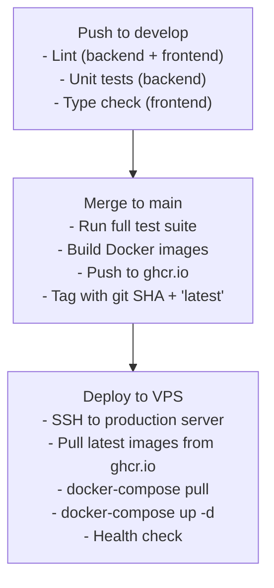

# ADR-008: Deployment & CI/CD Strategy

**Status:** Approved
**Date:** 2025-11-15
**Verification Date:** 2025-11-15
**Decision Maker:** Steve

## Context

Need automated testing, building, and deployment pipeline. Template provides GitHub Actions baseline.

## Decision

Use GitHub Actions with GitHub Container Registry (GHCR) for Docker images.

## Pipeline Flow



## Why GHCR Over Docker Hub

- Integrated with GitHub (same place as code)
- Private by default (no accidental public images)
- Unlimited storage for public repos
- Better monorepo support

## Zero-Downtime Strategy

```yaml
# docker-compose.yml
services:
  backend:
    deploy:
      update_config:
        parallelism: 1
        delay: 10s
        order: start-first # New container starts before old stops
```

## Consequences

- **Positive:** Fully automated deployment
- **Positive:** GHCR keeps everything in GitHub
- **Positive:** Rolling updates prevent downtime
- **Negative:** Requires VPS SSH access (standard practice)
- **Positive:** Git SHA tagging enables rollback
