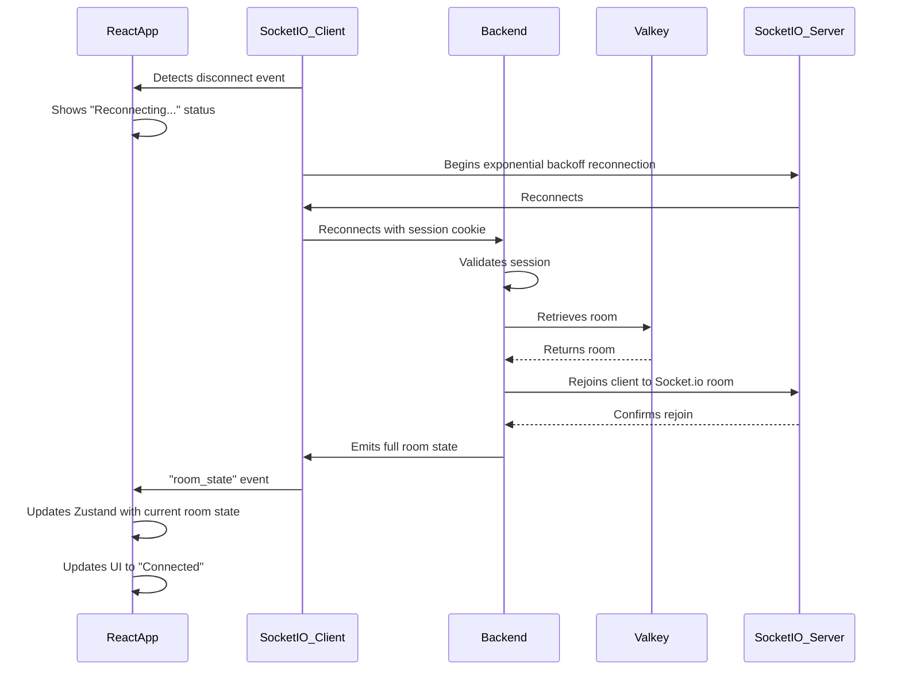

# Frontend State Management Architecture

This document details the frontend state management architecture, which is responsible for managing the application state on the client-side.

## Architectural Decisions

- **[ADR-006: Frontend State Management](./../adrs/006-frontend-state-management.md)**

## Technology Stack

| Component | Technology | Version | Purpose                 |
| --------- | ---------- | ------- | ----------------------- |
| **State** | Zustand    | 4.4+    | Global state management |

## Component Interaction Flow

### Flow 3: Reconnection After Disconnect

See the [JSON Schema](./json-schema.md) for detailed data structures.
