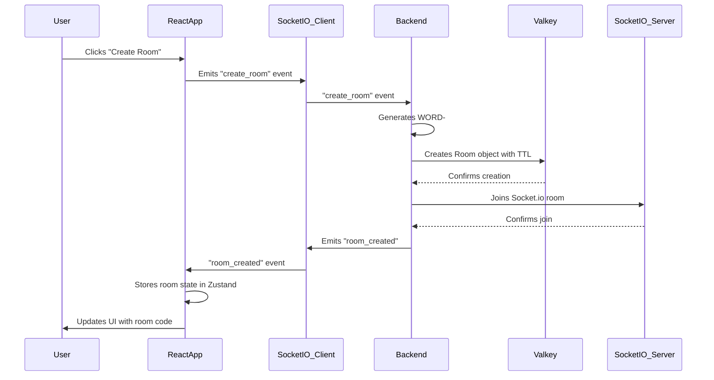
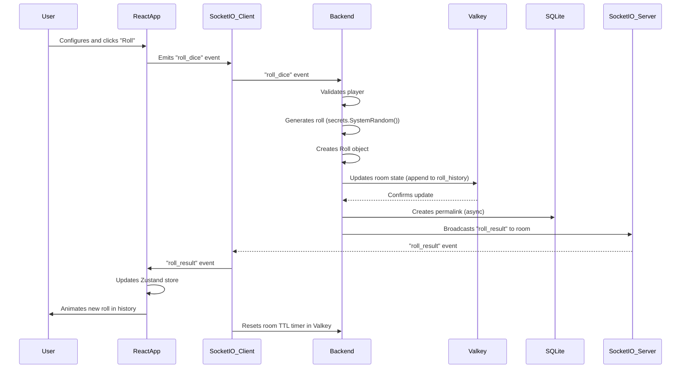

# Real-Time Dice Rolling Architecture

This document details the real-time dice rolling architecture, which is a core component of the D&D Dice Roller application.

## Architectural Decisions

- **[ADR-002: WebSocket Architecture Pattern](./../adrs/002-websocket-architecture.md)**
- **[ADR-005: Roll Generation Security](./../adrs/005-roll-generation-security.md)**

## Technology Stack

| Component     | Technology       | Version | Purpose                               |
| ------------- | ---------------- | ------- | ------------------------------------- |
| **WebSocket** | python-socketio  | 5.10+   | Real-time bidirectional communication |
| **WebSocket** | socket.io-client | 4.6+    | Real-time client                      |

## Component Interaction Flow

### Flow 1: Create Room



### Flow 2: Roll Dice



## API Design

### Socket.io Events API

#### Client → Server Events

##### create_room

**Payload:**

```typescript
{
  mode: 'open' | 'dm-led',
  player_name: string  // 1-20 chars
}
```

**Response (via callback):**

```typescript
{
  room_code: string,      // "ALPHA-1234"
  player_id: string,      // UUID
  player_session: string  // Session token
}
```

**Error Response:**

```typescript
{
  error: string,
  code: 'RATE_LIMIT' | 'INVALID_NAME' | 'SERVER_ERROR'
}
```

---

##### join_room

**Payload:**

```typescript
{
  room_code: string,      // "ALPHA-1234"
  player_name: string     // 1-20 chars
}
```

**Response (via callback):**

```typescript
{
  player_id: string,
  room_state: Room        // Full room object
}
```

**Error Codes:**

- `ROOM_NOT_FOUND`
- `ROOM_FULL` (8 players max)
- `KICKED` (session previously kicked)
- `INVALID_NAME`

---

##### roll_dice

**Payload:**

```typescript
{
  dice: string,           // "1d20", "3d6", etc.
  modifier: number,       // -10 to +20
  hidden: boolean,        // DM only
  advantage: 'none' | 'advantage' | 'disadvantage'
}
```

**Response:** None (broadcasts to room)

**Error Codes:**

- `NOT_IN_ROOM`
- `INVALID_DICE_FORMAT`
- `HIDDEN_NOT_ALLOWED` (non-DM in DM-led room)
- `RATE_LIMIT` (10 rolls per 10 seconds)

---

##### reveal_roll

**Payload:**

```typescript
{
  roll_id: string; // UUID of hidden roll
}
```

**Response:** None (broadcasts to room)

**Error Codes:**

- `NOT_DM`
- `ROLL_NOT_FOUND`
- `ROLL_NOT_HIDDEN`

---

##### set_dc

**Payload:**

```typescript
{
  dc: number | null; // 1-30 or null to clear
}
```

**Response:** None (broadcasts to room)

**Error Codes:**

- `NOT_DM`
- `INVALID_DC` (out of range)

---

##### promote_to_dm

**Payload:**

```typescript
{
  new_dm_player_id: string; // UUID
}
```

**Response:** None (broadcasts to room)

**Error Codes:**

- `NOT_ROOM_CREATOR`
- `PLAYER_NOT_FOUND`
- `ALREADY_DM_LED`

---

##### kick_player

**Payload:**

```typescript
{
  player_id: string; // UUID to kick
}
```

**Response:** None (broadcasts to room)

**Error Codes:**

- `NOT_ADMIN`
- `CANNOT_KICK_SELF`
- `PLAYER_NOT_FOUND`

---

#### Server → Client Events

##### room_created

**Payload:**

```typescript
{
  room_code: string,
  room_state: Room
}
```

---

##### player_joined

**Payload:**

```typescript
{
  player: Player;
}
```

---

##### player_left

**Payload:**

```typescript
{
  player_id: string,
  reason: 'disconnect' | 'kicked' | 'room_closed'
}
```

---

##### roll_result

**Payload:**

```typescript
{
  roll: Roll;
}
```

**Note:** If `roll.hidden === true` and recipient is not DM, `individual_results` and `total` are omitted.

---

##### roll_revealed

**Payload:**

```typescript
{
  roll_id: string,
  individual_results: number[],
  total: number
}
```

---

##### dc_updated

**Payload:**

```typescript
{
  dc: number | null;
}
```

---

##### room_mode_changed

**Payload:**

```typescript
{
  mode: 'dm-led',
  dm_player_id: string,
  timestamp: number
}
```

---

##### room_expiring

**Payload:**

```typescript
{
  seconds_remaining: number; // 180 or 30
}
```

---

##### room_closed

**Payload:**

```typescript
{
  reason: 'expired' | 'creator_closed' | 'server_shutdown';
}
```

---

##### player_kicked

**Payload:**

```typescript
{
  player_id: string;
}
```

---

##### error

**Payload:**

```typescript
{
  message: string,
  code: string,
  context?: object
}
```
